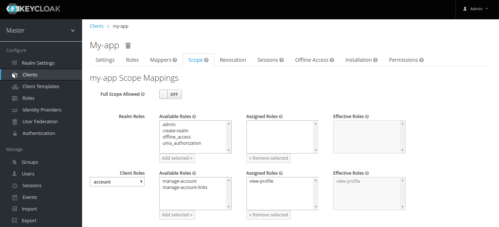

# Keycloak Angular

[](https://opensource.org/licenses/MIT)
[](https://travis-ci.org/mauriciovigolo/keycloak-angular)
[](https://snyk.io/test/github/mauriciovigolo/keycloak-angular)
[](https://badge.fury.io/js/keycloak-angular)

[](#contributors)
[](https://slackin-iijwrzzihr.now.sh)
[](https://david-dm.org/mauriciovigolo/keycloak-angular?path=projects/keycloak-angular)
[](https://david-dm.org/mauriciovigolo/keycloak-angular?type=dev)

> Easy Keycloak setup for Angular applications.

---

- [About](#about)
- [Install](#install)
- [Setup](#setup)
  - [Angular](#angular)
  - [Keycloak](#keycloak)
- [AuthGuard](#authguard)
- [HttpClient Interceptor](#httpclient-interceptor)
- [Contributors](#contributors)
- [License](#license)

---

## About

This library helps you to use [keycloak-js](https://github.com/keycloak/keycloak-js-bower) in Angular > v4.3 applications providing the following features:

- A **Keycloak Service** which wraps the keycloak-js methods to be used in Angular, giving extra
  functionalities to the original functions and adding new methods to make it easier to be consumed by
  Angular applications.
- Generic **AuthGuard implementation**, so you can customize your own AuthGuard logic inheriting the authentication logic and the roles load.
- A **HttpClient interceptor** that adds the authorization header to all HttpClient requests.
  It is also possible to disable this interceptor or exclude routes from having the authorization header.
- This documentation also assists you to configure the keycloak in the Angular applications and with
  the client setup in the admin console of your keycloak installation.

## Install

### Choosing the appropriate version of keycloak-angular

This library depends on angular and keycloak versions so as it might exist breaking changes in some of them there are
different build versions supporting these combinations, so be aware to choose the correct version for your project.

| keycloak-angular | Angular | Keycloak | SSO-RH |
| :--------------: | :-----: | :------: | :----: |
|      1.3.x       | 4 and 5 |    3     |   7    |
|      2.x.x       | 4 and 5 |    4     |   -    |
|      3.x.x       |    6    |    3     |   7    |
|      4.x.x       |    6    |    4     |   -    |
|      5.x.x       |    7    |    3     |   7    |
|      6.x.x       |    7    |    4     |   -    |

**Warning**: This library will work only with versions higher or equal than 4.3.0 of Angular. The reason for this is that keycloak-angular uses the Interceptor from `@angular/common/http` package and this feature was available from this version on.

### Steps to install using NPM or YARN

> Please, again, be aware to choose the correct version, as stated above. Installing this package without a version will make it compatible with the **latest** angular and keycloak versions.

In your angular application directory:

With npm:

```sh
npm install --save keycloak-angular@<choosen-version-from-table-above>
```

With yarn:

```sh
yarn add keycloak-angular@<choosen-version-from-table-above>
```

## Setup

### Angular

The KeycloakService should be initialized during the application loading, using the [APP_INITIALIZER](https://angular.io/api/core/APP_INITIALIZER) token.

#### AppModule

```js
import { NgModule, APP_INITIALIZER } from '@angular/core';
import { KeycloakService, KeycloakAngularModule } from 'keycloak-angular';
import { initializer } from './utils/app-init';

@NgModule({
  imports: [KeycloakAngularModule],
  providers: [
    {
      provide: APP_INITIALIZER,
      useFactory: initializer,
      multi: true,
      deps: [KeycloakService]
    }
  ]
})
export class AppModule {}
```

- **Notice** that the KeycloakAngularModule was imported by the AppModule. For this reason you don't need to insert the KeycloakService in the AppModule providers array.

#### initializer Function

This function can be named and placed in the way you think is most appropriate. In the
underneath example it was placed in a separate file `app-init.ts` and the function was called
`initializer`.

```js
import { KeycloakService } from 'keycloak-angular';

export function initializer(keycloak: KeycloakService): () => Promise<any> {
  return (): Promise<any> => keycloak.init();
}
```

### Keycloak

Besides configuring the keycloak lib in your application it is also necessary to setup the
access - scope for the **account** client.

In this documentation we assume that you already installed and configured your Keycloak
instance, as well created the client app.

**Hint:** If you need to create an environment for testing purposes, try out the [Keycloak demo](http://www.keycloak.org/downloads.html) or the official [keycloak docker image](https://hub.docker.com/r/jboss/keycloak/).

#### Client configuration

When requesting the method to get the User's Profile, the client app should have the scope and access to the account **view-profile** role. To do it, access **Clients** :arrow_right: **My-app** :arrow_right: **Scope**. Select the **account** app in Client Roles and assign the view-profile role.



## AuthGuard

A generic AuthGuard, `KeycloakAuthGuard`, was created to help you bootstrap your security configuration and avoid duplicate code. This class already checks if the user is logged in and get the list of roles from the authenticated user, provided by the keycloak instance. In your implementation you just need to implement the desired security logic.

Example:

```js
import { Injectable } from '@angular/core';
import { CanActivate, Router, ActivatedRouteSnapshot, RouterStateSnapshot } from '@angular/router';
import { KeycloakService, KeycloakAuthGuard } from 'keycloak-angular';

@Injectable()
export class AppAuthGuard extends KeycloakAuthGuard {
  constructor(protected router: Router, protected keycloakAngular: KeycloakService) {
    super(router, keycloakAngular);
  }

  isAccessAllowed(route: ActivatedRouteSnapshot, state: RouterStateSnapshot): Promise<boolean> {
    return new Promise((resolve, reject) => {
      if (!this.authenticated) {
        this.keycloakAngular.login();
        return;
      }

      const requiredRoles = route.data.roles;
      if (!requiredRoles || requiredRoles.length === 0) {
        return resolve(true);
      } else {
        if (!this.roles || this.roles.length === 0) {
          resolve(false);
        }
        let granted: boolean = false;
        for (const requiredRole of requiredRoles) {
          if (this.roles.indexOf(requiredRole) > -1) {
            granted = true;
            break;
          }
        }
        resolve(granted);
      }
    });
  }
}
```

## HttpClient Interceptor

By default all HttpClient requests will add the Authorization header in the format of: Authorization: Bearer **_TOKEN_**.

There is also the possibility to exclude a list of URLs that should not have the authorization header. The excluded list must be informed in the keycloak initialization. For example:

```js
try {
  await keycloak.init({
    config: {
      url: 'http://localhost:8080/auth',
      realm: 'your-realm',
      clientId: 'client-id'
    },
    initOptions: {
      onLoad: 'login-required',
      checkLoginIframe: false
    },
    enableBearerInterceptor: true,
    bearerExcludedUrls: ['/assets', '/clients/public']
  });
  resolve();
} catch (error) {}
```

## Contributors

<!-- ALL-CONTRIBUTORS-LIST:START - Do not remove or modify this section -->

<!-- prettier-ignore -->
 |[<br /><sub><b>Mauricio Gemelli Vigolo</b></sub>](https://github.com/mauriciovigolo)<br />|[<br /><sub><b>Frederik Prijck</b></sub>](https://github.com/frederikprijck)<br /> | [<br /><sub><b>jmparra</b></sub>](https://github.com/jmparra)<br /> | [<br /><sub><b>Marcel Német</b></sub>](https://github.com/marcelnem)<br /> | [<br /><sub><b>Raphael Alex Silva Abreu</b></sub>](https://github.com/aelkz)<br /> |
| :---: | :---: | :---: | :---: | :---: |

<!-- ALL-CONTRIBUTORS-LIST:END -->

If you want to contribute to the project, please check out the [contributing](docs/CONTRIBUTING.md)
document.

## License

**keycloak-angular** is licensed under the **[MIT](LICENSE)**.

[keycloak-js](https://github.com/keycloak/keycloak-js-bower) is licensed under the **Apache 2.0**.
